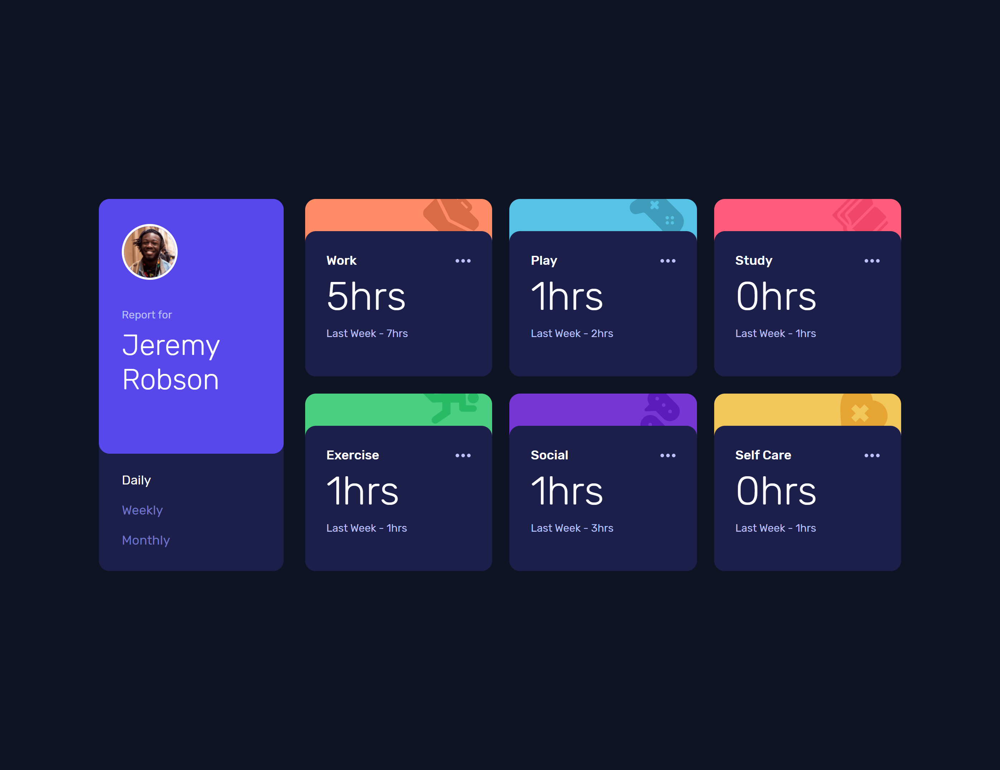

# Frontend Mentor - Time tracking dashboard solution

This is a solution to the [Time tracking dashboard challenge on Frontend Mentor](https://www.frontendmentor.io/challenges/time-tracking-dashboard-UIQ7167Jw).

## Table of contents

-   [Overview](#overview)
    -   [The challenge](#the-challenge)
    -   [Screenshot](#screenshot)
    -   [Links](#links)
-   [My process](#my-process)
    -   [Built with](#built-with)
    -   [What I learned](#what-i-learned)
-   [Author](#author)

## Overview

### The challenge

Users should be able to:

-   View the optimal layout for the site depending on their device's screen size
-   See hover states for all interactive elements on the page
-   Switch between viewing Daily, Weekly, and Monthly stats

### Screenshot

### Links

-   Solution URL: [Solution URL](https://github.com/Andro87/time-tracking-dashboard.git)
-   Live Site URL: [Live site URL](https://time-tracking-dashboard-tawny.vercel.app/)

## My process

### Built with

-   Semantic HTML5 markup
-   SCSS custom properties
-   FlexBox
-   CSS Grid
-   Mobile-first workflow
-   [React](https://reactjs.org/) - JS library
-   [Next.js](https://nextjs.org/) - React framework

### What I learned

This project was a great opportunity to test and practice my CSS Grid skills.

## Author

-   Frontend Mentor - [@Andro87](https://www.frontendmentor.io/profile/Andro87)
